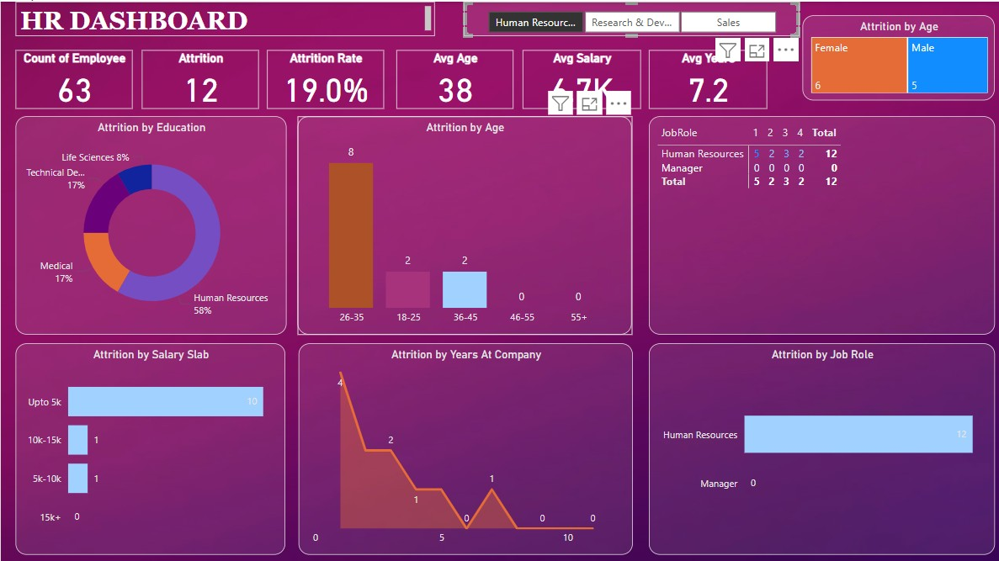

# HR_Analytics_Dashboard

Project Description
The HR Analytics Dashboard is a Power BI-based solution designed to provide actionable insights into key HR metrics. It visualizes data related to employee performance, retention rates, recruitment trends, and workforce demographics to empower HR teams and organizations to make informed decisions on talent management and resource allocation.

Features
Employee Demographics: Visualize data on employees' age, gender, and other demographic factors.
Turnover Rates: Track employee turnover, retention, and reasons for attrition.
Performance Analytics: Measure employee performance through various KPIs and ratings.
Recruitment Trends: Analyze the effectiveness of hiring campaigns and recruitment efforts.
Interactive Visualizations: Use Power BI's interactive charts, filters, and slicers to explore HR data and trends.

Technologies Used
Power BI: Data visualization and reporting.
DAX: Data analysis expressions for complex calculations.
Power Query: Data transformation and cleaning.
Excel: Data preprocessing (if required).
SQL: Database queries for data extraction.

Installation and Setup
Clone or download the repository.
Import the Power BI file into your Power BI Desktop application.
Connect to your HR data source (Excel, SQL Database, or other).
Refresh the dataset to load the latest data.
Explore the dashboard and use filters to customize your analysis.

How to Use
Navigate through the different tabs to view key metrics such as employee demographics, performance, and turnover rates.
Use the slicers to filter data by department, age group, tenure, etc.
Analyze trends and patterns for better decision-making in HR management.

Conclusion
The HR Analytics Dashboard provides a comprehensive, data-driven approach to managing and improving an organization’s workforce. It helps HR teams to identify areas for improvement and optimize their strategies for talent acquisition and retention.

